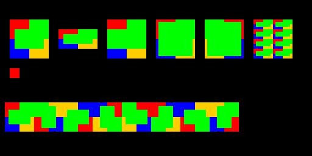
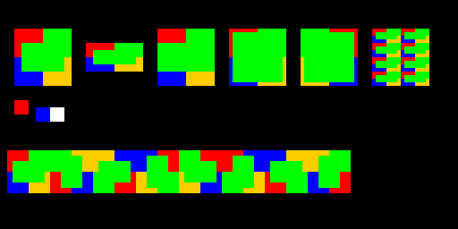
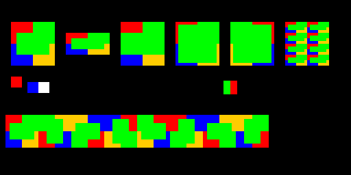

# ADR-0022: 2D rendering features informed by Bevy

- Status: Accepted
- Date: 2026-10-06
- Implementation: Partial (local foundation; not released)

## Context

AdaEngine already provides sprite batching and frustum culling, grid and named
texture atlases, Mesh2D/CanvasMaterial, Text2D, layered tile maps with LDtk,
and 2D lights, cookies and polygon shadow occluders. AdaUI already supports
nine-slice images. These are existing foundations, not missing features.

The local Bevy checkout inspected for this decision is 0.20.0-dev at
`8081542c2`. Its API and examples provide useful references, including features
that may differ from a stable release. Adapt their contracts to Swift and the
existing AdaEngine render world rather than importing a second ECS or renderer.

## Decision

Implement the following independently validated stages, in order.

### 1. Sprite layout and tile orientation

Add a normalized sprite anchor with center as the default; positive Y points
up. Anchors affect local geometry and bounds before the world transform. Image
flips change sampling and do not move the anchor.

Add stretch, centered aspect fit/fill, nine-slice and tiled image modes.
Preserve current stretch behavior by default. Slice borders are source-pixel
sizes, with proportional corner shrinkage when the destination is too small.
Tiled modes clip partial repetitions and sample within the selected atlas
region, without relying on GPU texture wrapping across atlas entries.
Invalid/non-finite dimensions must not generate invalid or unbounded geometry.
Keep the ordinary one-quad path inexpensive and preserve texture/sampler
batching and painter order when one sprite produces multiple quads.

Add all eight square tile orientations (quarter turns and reflected quarter
turns), applied within a cell. Orient atlas sampling and entity-tile geometry
consistently, including shadow occluders. Orientation changes invalidate the
owning layer. Existing resources without these fields decode to identity.

This stage initially targets the native Swift API and runtime resource path.
Editor controls and AdaScript authoring exposure are explicit follow-up work;
do not claim authoring support from runtime tests alone. Preserve existing
scene payloads and unrelated editor changes.

### 2. Shared picking

Introduce a runtime picking service/plugin with bounds and alpha-threshold
modes, camera/viewport awareness, world transforms, atlas regions, anchors,
image modes, visibility and depth ordering. Pointer hover/click/drag events
must compose with UI blocking. Reuse it in the editor after runtime validation.
Keep CPU-readable image/alpha-mask ownership explicit; picking must not require
a synchronous GPU readback per pointer event.

### 3. Large-scene rendering

Introduce chunk-level tile-map representation, culling and dirty updates.
Retain entity tiles for gameplay/physics and preserve ordering around sprites
and layers. Consider Bevy's tile-data texture and one-quad-per-chunk design,
but choose representation after measuring AdaEngine's existing batching path.

Add sprite GPU instancing using shared quad geometry and per-instance data,
with a compatible fallback for supported backends. Measure CPU time, upload
bytes, draw counts and actual GPU cost separately. No performance improvement
is assumed from fewer allocations or draw calls alone.

### 4. Render modes and visual effects

Add standard opaque, alpha-mask and blended 2D material modes with separate
render phases and defined depth semantics. Extend existing CanvasMaterial
support with convenient sprite materials and UV transforms.

Provide a pixel-perfect composition preset using a fixed-resolution render
target, nearest sampling and integer presentation scaling; keep high-resolution
UI separate. Add an opt-in HDR 2D render target, bloom and tone mapping with
defined UI composition, backend fallback and color-space behavior. Reuse
renderer infrastructure where contracts match; 3D tone mapping alone does not
establish 2D HDR support.

### Additional follow-up

Expand runtime 2D mesh builders (ellipse, capsule, annulus, sector and regular
polygon). Existing AdaUI shapes do not establish equivalent Mesh2D builders.
Unify reusable slicing math with AdaUI when doing so preserves its public API.
Sprite animation, particles and navigation require their own requirements;
Bevy examples or ecosystem plugins are not evidence of built-in engines.

## Implementation checklist

- [x] Sprite anchor, culling bounds and legacy decoding.
- [x] Stretch/fit/fill/sliced/tiled modes through the production batching path.
- [x] Tile orientation, invalidation, serialization and occluder consistency.
- [x] Visible sprite/tile reference scene and recorded backend validation (offscreen Metal).
- [ ] Editor controls, resource round trips and AdaScript authoring exposure.
- [x] Runtime picking and editor integration (native Swift and viewport event path).
- [x] Chunked tile-map rendering with realistic performance evidence (debug/headless CPU preparation; Metal/native WGPU pixels).
- [ ] Sprite instancing with ordering and backend coverage.
- [ ] Alpha phases, sprite material convenience and UV transforms.
- [ ] Pixel-perfect presentation preset.
- [ ] HDR 2D, bloom, tone mapping and UI composition.
- [ ] Additional runtime 2D mesh builders.

## Validation requirements

Use Swift Testing against the real extraction, bounds and batching systems.
Cover old resource decoding, noncentral anchors, parent transforms, flips,
atlas UVs, fit/fill cropping, undersized nine-slice destinations, partial tiles,
invalid dimensions and interleaved render items. Test all eight tile
orientations, shared map owners, resource round trips and shadow geometry.
Capture a real render scene before claiming visible/backend correctness.
Record source tests, native GPU proof and other-platform coverage separately.

## Recorded implementation

The first local slice adds `SpriteAnchor`, `SpriteImageMode` and
`SpriteSliceBorder` to AdaSprite. Extraction preserves them, bounds account
for the anchor, and the existing sprite batch emits one or more quads while
retaining atlas UVs, image flips, painter order and index offsets. Geometry
streams directly into the existing buffers. Tiling is capped at 16,384 quads
per sprite, with a stretch fallback beyond the cap; invalid dimensions or
scale emit no geometry.

```swift
Sprite(
    texture: texture,
    size: Size(width: 160, height: 80),
    anchor: .bottomCenter,
    imageMode: .sliced(SpriteSliceBorder(8))
)
// Other modes: .stretch, .fit, .fill, .tiled(tileX: true, tileY: false, scale: 2).
layer.setCell(at: [2, 3], sourceId: sourceID, atlasCoordinates: [0, 0], orientation: .mirrorXRotate90)
```

`TileOrientation` uses eight values: identity, three counterclockwise quarter
turns, and X reflection followed by each of those four rotations. Quarter-turn
scale correction keeps rectangular cells at their display size. Both direct
atlas extraction and entity-tile transforms use the same orientation. Native
tile resources encode an optional `orientation` field; portable palette cells
accept an optional fourth integer, `[x, y, paletteIndex, orientationID]`.
Old resources default to identity. Sprite drawing is two-sided so reflected
transforms remain visible. Lighting extraction restores world-space CCW winding
after reflection, without changing the authored polygon.

On 2026-10-06, Swift 6.2.4 passed 40 tests in the focused AdaSprite/tile suites.
Tests cover resource defaults and round trips, world transforms, anchor bounds,
aspect fit/fill, asymmetric slice flips, undersized corners, partial atlas
repetitions, tile budgets, batch boundaries, all eight tile orientations,
shared owners and reflected occluder winding. Targeted SwiftLint and
`git diff --check` also passed.

The broader AdaRender/AdaScene/AdaSprite/tile regression run passed 169 tests
in 30 suites, including native Metal resource and Mesh2D pipeline tests.

The opt-in `SpriteMetalRenderingTests` passed separately using the actual Metal
backend, production extraction/batching/draw pass, GPU completion and image
readback with pixel assertions. Run it alone in a fresh process because other
tests initialize a headless renderer:

```sh
ADAENGINE_DISABLE_SWAN=1 ADAENGINE_SPRITE_METAL_SMOKE=1 \
ADAENGINE_SPRITE_METAL_CAPTURE=/tmp/adaengine-sprite-layout.png \
swift test --filter SpriteMetalRenderingTests
```

Use an isolated SwiftPM scratch path and module caches if the shared build
contains another toolchain's modules. Metal validation requires actual GPU
access; the sandboxed process reported that Metal was unavailable.



The top row shows stretch, fit, fill, nine-slice, reflected nine-slice and
tiling. The red square below demonstrates a bottom-left anchor. The lower row
shows tile orientation IDs 0...7.

This records native Swift runtime and offscreen Metal proof. Editor inspector
controls, AdaScript authoring of the new layout types, embedded Web Player
authoring paths, physical iOS/Android and browser WebGPU rendering remain unverified
or planned. Later roadmap stages remain open.

### Picking implementation

The second local slice adds the shared `SpritePicker` service and opt-in
`SpritePickingPlugin`, `SpritePickable`, `SpritePickingView` and
`SpritePointerEvent`. Install the plugin alongside the default input, sprite
and event lifecycle plugins; mark interactive sprites with `SpritePickable()`.
Offscreen cameras can explicitly map their input window through
`SpritePickingView(window: .primary)`.

The hit test intersects the camera's viewport/clip ray with the transformed
sprite plane and inverts the same layout used for rendering. It covers anchors,
fit margins, fill cropping, slice corners, tiled partial repetitions, atlas
regions and image flips. Painter order uses the sprite transform's world Z;
nonblocking candidates also deliver hits to lower sprites. Runtime picking
respects active entities, visibility, camera render order, window identity and
the renderer's per-camera visible set.

Textures retain an immutable CPU alpha mask at image upload: one byte per
texel, or a constant for uniformly opaque/transparent images. Grid/named atlas
slices share the backing mask; proxies and animated textures forward to their
current source. GPU writes invalidate stale masks. Alpha picking samples nearest
base-level texels and multiplies by tint alpha; filtering/mipmap edge coverage
is not a pixel-exact antialiasing contract. GPU-only/invalidated textures use an
explicit bounds or ignore fallback. No pointer hit test reads GPU pixels.

Pointer state is world-owned and distinguishes windows, mouse buttons and touch
contact identities. The post-update system runs after transform propagation and
before input cleanup, publishing enter/exit/move/down/up/click/drag/cancel events.
Captured drags retain their target outside sprite/viewport bounds; removed,
hidden or disabled targets cancel. UI routing blocks both individual events
and current pointer locations, including stationary pointers under appearing
overlays. UI-started gestures cannot leak clicks after leaving the UI.

The two-contact regression exposed clock-resolution collisions in `RID()`.
Generation now uses a synchronized monotonic sequence above the clock value;
consecutive and concurrent producer tests cover uniqueness.

Editor 2D sprite selection calls the shared hit test using currently composed
parent transforms, even before ECS propagation. Non-sprite editor entities
retain a bounds fallback. The scene decoder preserves anchor/image-mode data;
this does not add Inspector authoring controls for those types.

The focused picking/input/UI/resource-ID run passed 28 tests in six suites.
The editor picking and scene regression run passed 33 tests in three suites,
including the real viewport input handler and scene rendering paths. The final
ECS/utils/render/scene/sprite/input/UI/tile regression run passed 345 tests in
59 suites. The separate opt-in Metal test passed GPU pixel assertions and
verified that picking selects the blue lower sprite through a transparent
texel and the white upper sprite through an opaque texel.


The blue/white rectangle beside the red anchor sample is the overlap fixture.
Both visible pixels and picked entity IDs are asserted in the Metal test.
This validates native Swift runtime, editor viewport event handling and
offscreen Metal. Physical touch devices, interactive editor window QA and
browser WebGPU are not covered by these runs. New-source SwiftLint and diff whitespace
checks passed; unchanged legacy files retain pre-existing lint warnings.

### Native WebGPU verification

On 2026-10-06 the shared reference scene passed on the actual `.webgpu` backend
using native Dawn, Apple M3 Pro and Swift 6.3.2. The test explicitly requires
that backend, so Metal/headless fallback cannot count as a pass. WGSL is
compiled from the bundled production GLSL through Tint. The adapter log reports
Dawn's Metal driver on macOS, and the completed run contains no WebGPU
validation errors.

The test verifies the same sprite modes, anchors, atlas UVs, eight tile
orientations and alpha click-through against read-back GPU pixels. An extra
3x2 BGRA target verifies 256-byte texture-copy row alignment and tightly packed
owned CPU pixels. Textures without copy-source usage return nil safely.
The native WebGPU PNG is byte-identical to the Metal control capture.



Validation exposed the old WebGPU synchronous readback accessing an unmapped
copy buffer. `RenderDevice.readImage(from:)` now provides asynchronous readback:
WebGPU copies aligned rows, awaits the existing mapped-buffer readback and owns
the CPU data before destroying GPU staging resources. Existing backends have a
default implementation through `getImage`. WebGPU's synchronous `getImage`
returns nil; callers needing WebGPU capture must await `readImage`. This path
is native-only; browser readback remains unsupported by this implementation.

The WGPU-enabled regression run passed 185 tests in 32 suites. The separate
WebGPU smoke and Metal control each passed, as did targeted SwiftLint and
`git diff --check`. Dependency resolution changes used only for validation
were restored; source build/module caches were isolated under `/tmp`.

Reproduction uses a compatible Swift 6.3 toolchain, Swan and a Tint executable:

```sh
ADAENGINE_WEB_EXPORT=1 ADAENGINE_SPRITE_WGPU_SMOKE=1 \
TINT_EXECUTABLE=/path/to/tint \
swift test --filter SpriteMetalRenderingTests/rendersLayoutsAndPickingWithWebGPU
```

The recorded run used Swan revision `1eb45a22c79439b50e9cde774454450e50147149`
and Tint/Dawn source `e75b7342117dbf775a80a6220f3876a3e4f180a3`. The native
renderer must run in a fresh process with real GPU access. This verifies native
WebGPU on macOS; it does not establish WASM/browser, Windows, Linux or Android
rendering, nor physical-device touch behavior.

### Tile-map chunk implementation

Static atlas cells now use 32x32-cell spatial chunks and cached local GPU
vertices/indices. `TileMapComponent.renderMode` defaults to `.chunks`; `.sprites`
retains the production per-tile reference path. This is cached mesh geometry,
not the one-quad/tile-data-texture design. The choice keeps existing atlases,
samplers, tile orientations and materials without a new texture-array contract.

Layers maintain a spatial cell index and chunk revision stamps. A cell edit
rebuilds only its chunk; no-op writes do not invalidate. Structural/source,
display-size and layer-depth changes fully invalidate the affected owner/layer.
Shared owners compare their own revisions even after another consumer clears
the layer's update flag. Empty chunks are removed. Aggregate map bounds use
cached chunk bounds instead of scanning every cell after a local edit.

Render extraction contributes chunk snapshots instead of one item per static
tile. Preparation culls each transformed AABB against each camera's frustum,
honors `NoFrustumCulling` and caches immutable GPU geometry by snapshot identity.
Steady frames upload only the owner model uniform; static vertex/index upload
is zero. GPU cache entries retain source identities and prune when snapshots
disappear. Each draw is scoped to its camera, layer Z and backing texture/sampler.

Animated atlas tiles retain individual sprite extraction. Entity tiles retain
ECS children and their gameplay components. Atlas occluders use the chunk
occlusion path described below, keeping their images in atlas geometry. A static edit
in another chunk does not recreate those children. If the owner's XY plane is
tilted into Z, extraction uses the sprite reference path to retain per-cell
world-Z painter ordering. Ordinary sprites still interleave with flat layers;
non-overlapping cells within a chunk may group by backing texture/sampler.

Validation on 2026-10-06:

- 28 focused chunk/tile/orientation tests passed, including the opt-in large-map
  benchmark. Coverage includes negative coordinates, dirty/no-op/deleted chunks,
  shared owners, camera isolation, reflected bounds, entity/animated fallbacks,
  tilted ordering and layer/sprite interleaving.
- Metal and native WebGPU reference-scene tests passed. In each backend, chunk
  and sprite modes produced identical raw pixels, including all eight tile
  orientations and a reflected two-layer map around an ordinary sprite.
- The chunked Metal and WebGPU PNGs are byte-identical; the WGPU run reported
  no validation errors.
- 377 engine/render/sprite/ECS regression tests in 77 suites passed in the
  WGPU-enabled configuration. Targeted SwiftLint and whitespace checks passed.

The warmed debug/headless benchmark exercises actual extraction, preparation,
sorting and sprite buffer construction for 65,536 cells (256x256), with a small
camera viewport crossing four chunk boundaries. Eight measured frames averaged:

| Path | Render preparation CPU | Render items | Per-frame sprite vertices | Static chunk upload |
| --- | ---: | ---: | ---: | ---: |
| Sprites reference | 418.08 ms | 65,536 | 262,144 | n/a |
| Cached chunks | 0.35 ms | 4 | 0 | 0 bytes |

The reference already batches the uniform atlas into one GPU submission;
the visible chunk path uses four chunk draws. These measurements establish a
CPU/preparation reduction in this workload, not GPU timing, display FPS,
release-build performance or a universal speedup. Editing one cell preserved
63 of 64 chunk identities. Reproduce with
`ADAENGINE_TILE_CHUNK_BENCHMARK=1 swift test --filter TileMapChunkTests/largeMapBenchmark`.



The lower row exercises tile orientations; the green/red square beside the
alpha picking sample exercises reflected layer/sprite ordering. Browser/WASM,
physical mobile devices, chunk streaming/eviction budgets and GPU timing remain
outside this validation. Sprite GPU instancing is a separate open checklist item.

## Tile occlusion authoring and chunk cache

Static wall occlusion is authored as atlas tile data, rather than as one ECS
entity per painted cell. `TextureAtlasTileSource.setOccluderPolygon(_:at:referenceSize:)`
validates and updates the definition. The `.tileset` tile's existing `ad.td.occ`
field stores centered, positive-Y-up points; optional `occSize` stores their
reference cell dimensions. New editor-authored polygons scale with
`TileMapComponent.tileDisplaySize`. Legacy polygons without a reference size
keep their original local-space coordinates. Both polygon windings are accepted;
self-intersections, degenerate rings, nonfinite coordinates and more than 256
vertices are rejected by the authoring API.

`TileMapLayer.setCellOcclusion(_:at:)` applies a sparse override on an existing
cell: nil inherits the tileset, `.disabled` removes occlusion, and `.polygon`
replaces the shape. Overrides are independent of atlas selection and orientation,
are retained on cell edits, and are removed when the cell is erased. Native
source-ID cells encode an optional `occlusion`; editor palette resources encode
optional `cellOcclusion` records at the single-layer root or inside each
`paletteLayers` entry. Older files default to inheritance. Editor scene payloads
and the native scene loader carry these records into Play.

The immutable chunk snapshot contains transformed map-local occlusion rings
alongside its atlas geometry. Atlas cells with polygons remain in static chunks
(or the ordinary animation fallback); they no longer create Sprite/occluder
children. A separate render-world cache retains world-space geometry keyed by
chunk snapshot identity and owner transform. It is reused across steady frames,
rebuilt for changed chunks/transforms and pruned for removed, hidden or disabled
owners/layers. Cell orientations and parent reflection are applied before
normalizing world winding to CCW. Extraction runs after ordinary light/occluder
extraction and appends to the same shadow pipeline. Occluders are not camera
frustum-culled: offscreen walls may cast visible shadows.

Editor workflow:

1. Open `.tileset`, select an authored tile, then use **Light occlusion** in the
   Inspector. Start with **Rectangle** or **Clear**, drag vertices, click edges
   to insert points, select/remove a point, then **Apply occlusion**.
2. Open `.tilemap`, choose **Select**, and click a painted cell on the active
   layer. In **Light occlusion**, choose **Inherit**, **Disabled**, or **Custom**.
   Custom shapes use the same visual editor and **Apply occlusion**.
3. Save/reopen and scene Play use the same persisted definitions and overrides.

Chunk occlusion caches retain independent rings; contour union and elimination
of internal edges between neighboring wall tiles are separate optimizations.
Arbitrary gameplay components continue to use entity tiles. This change does not
add generic component authoring or entity-tile serialization.

Validation on 2026-10-06:

- 385 engine/render/sprite/ECS tests in 78 suites passed in the native WGPU-enabled
  build. Occlusion coverage includes local/reference-size scaling, both winding
  orders, invalid rings, chunk reuse, cell exceptions, shared owners, reflected
  transforms, hidden/disabled layers, removal, plugin setup and palette loading.
- 31 editor tests in five suites passed, including production pointer-event
  dragging, Inspector actions, save/reopen, per-cell overrides, layer moves,
  palette removal, sparse-record cleanup and scene-file loading into runtime.
  An unapplied tile-size field draft does not alter polygon authoring coordinates.
- Metal and native WebGPU each passed the existing chunk/sprite reference render
  and the new real shadow-fin pipeline test. The shadow masks check inherited,
  disabled and custom polygon cells, GPU completion/readback and reflected
  geometry. Their PNGs are byte-identical. The WebGPU adapter was Apple M3 Pro
  using Dawn's Metal backend; no WGPU validation errors were reported.
- Root/Metal and editor validation used Swift 6.2.4. Native WGPU used Swift 6.3.2,
  task-owned scratch/cache paths, cached Dawn 147 artifacts and the existing Tint
  executable. Dependency-resolution changes were validation-only and restored.
- Targeted SwiftLint for the new files and `git diff --check` passed.


The upper row is the disabled cell (white mask); middle and lower rows cast
shadows to the right from inherited and custom shapes. This validates the real
shadow-mask pass, not a browser export or physical-device editor session.
Editor UI proof uses production AdaUI containers and pointer events; no native
Studio window was manually exercised. Browser/WASM and physical mobile authoring
remain outside this validation.

## References

- [Bevy sprite slicing](https://bevy.org/examples/2d-rendering/sprite-slice/)
- [Bevy sprite picking](https://bevy.org/examples/picking/sprite-picking/)
- [Bevy tile-map chunks](https://bevy.org/examples/2d-rendering/tilemap-chunk/)
- [Bevy alpha modes](https://bevy.org/examples/2d-rendering/mesh2d-alpha-mode/)
- [Bevy pixel grid](https://bevy.org/examples/2d-rendering/pixel-grid-snap/)
- [Bevy 2D bloom](https://bevy.org/examples/2d-rendering/bloom-2d/)

## Consequences

New APIs are additive, with backward-compatible resource defaults. Sprite and
tile geometry remain owned by AdaSprite/AdaTilemap; generic GPU facilities
belong in AdaRender/AdaCorePipelines. Each completed stage records its concrete
validation and remaining requirements. Acceptance of this roadmap does not
imply that every stage is implemented, released or verified on every platform.
