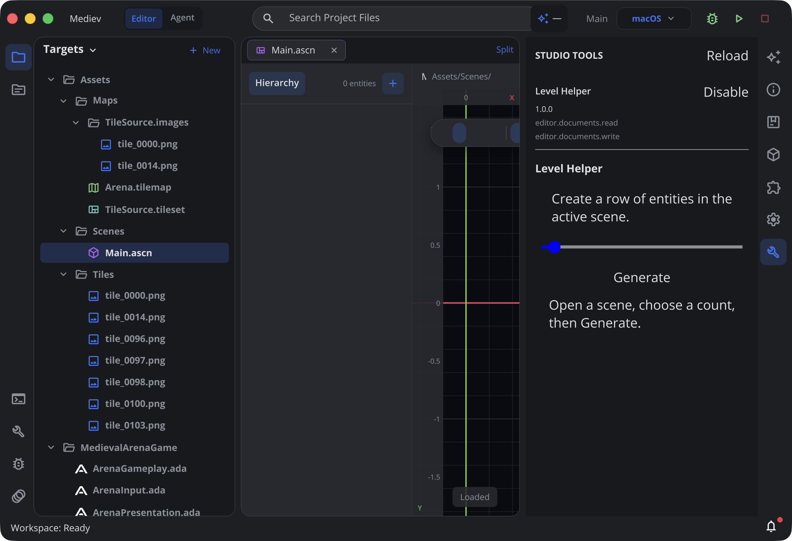

# Studio tools with .ui panels

Studio API 1 supports project-local AdaScript tools with a `.ui` panel in the
macOS workspace's right sidebar. Open **Studio Tools** using the wrench icon,
review the access dialog and click **Allow and Enable** before the tool code or
its `.ui` is activated. The panel contains the tool interface plus reload/settings
icons. Enablement, versions and access management live in **Settings → Project →
Studio Tools**. **Revoke Access** immediately retires panels and pending actions.

Tools are disabled by default. Grants are stored locally per project. Changed
source location, API, platforms or permissions require consent again. Earlier
implicit Enable records require confirmation in this explicit consent flow.
**Not Now** leaves the tool inactive; opening the panel or reloading does not
repeat the prompt until access is reviewed explicitly in settings.

Each folder immediately under the project's `Tools/` directory is a tool module.
Its `.ada` sources and relative imports are compiled together. IDs must be unique
across the project. Symbolic-link modules/sources are skipped. The reserved
project-level `Tools/` directory is excluded from the AdaScript game source loader,
including when the project's source root is `.`.

```
Tools/LevelHelper/
    LevelHelper.ada
    LevelHelper.ui
```

Copy [the complete Level Helper example](Examples/StudioTools/LevelHelper) into
this location in an existing project, open a scene, approve the tool access, choose the
count and click **Generate**. Undo reverses the entire batch; ordinary Save
persists it. The example creates empty entities with Transform components.

## Lifecycle and UI contract

`@tool` supplies metadata. `activate(editor)` registers panels with:

```adascript
editor.addPanel(id: "helper", title: "Helper", location: "right", ui: "Panel.ui");
```

`ui` is relative to the declaring `.ada` source and must resolve inside its tool
module. API 1 supports up to eight uniquely named right-sidebar panels per tool.
`deactivate()` is optional; registrations are always removed by the host when the
tool is disabled or its project closes.

The `.ui` file uses the existing Designer, typed inputs, bindings and named
actions. Each declared input must have an `@export` scalar field of the same name
and compatible type in the tool class. Booleans, strings, integers and floating
point fields are supported. Numeric UI values written to integer fields must be
exact integers. UI defaults are for Designer preview; the running tool's exported
values initialize the actual panel.

An action named `generate` invokes `func generate(editor)`. Callbacks must be
synchronous. The first parameter named `editor` receives typed language tooling.
Input edits remain in the panel's data context and are copied to exported fields
before an action; exported values are copied back after it. AdaUI construction
never calls the script VM. Actions are queued in order after the UI callback,
with a detached snapshot of inputs and the originating scene. Disabled or replaced
panels discard pending actions.

## Scene capabilities

`editor.scenePath`, `editor.sceneRevision` and `editor.entityCount` read the
originating scene snapshot and require `editor.documents.read`.
`editor.createEntity(name, x, y)` stages a root-level entity with a Transform and
requires `editor.documents.write`. An action may stage up to 256 entities.

The host applies the complete batch to the open document only after a successful
callback. A changed active document, stale revision, read-only scene or invalid
operation rejects the batch. Changes use the production scene model, dirty state
and document Undo/Redo history, preserving the user's selection and tool panel.
A failed script does not commit queued edits.
Script field changes themselves are not scene undo steps.

## Reload and execution boundaries

**Reload**, saved filesystem changes and dirty open tool documents reload the
module/panels. Valid `.ui` reloads retain input values. Successful script reloads
replace the instance and registrations; invalid source/UI leaves the previous
working version active and reports the error. Permission metadata changes retire
the old version until it is enabled again. Invalid discovery retains the existing
working set and reports its diagnostic.

The tool runtime uses the restricted AdaScript profile and bounds loops/functions,
callback time, VM allocation blocks, stack and recursion. It exposes no direct
editor models, native resource handles, process, network or workspace file APIs.
This is an in-process scripting profile, not OS process isolation. The supported
permissions in this first slice are document read/write; other requests fail.

The static language catalog includes planned command/menu/formatter/settings/event
APIs. Those registrations are not implemented by this panel host. iPadOS tools,
AdaScript `@view` panels, async tool callbacks and distribution/marketplace support
are not part of API 1's current macOS implementation.

## Verification

The initial macOS slice was checked on 2026-10-10 with 12 passing
`EditorStudioToolsTests` in the initial slice and clean SwiftLint for the new source/test files.
The native Studio window mounted the sample `.ui`, executed Generate to add three
entities, retained the selected entity and the tool panel, and removed the entire
batch through ordinary scene Undo. The tests also cover Redo and Save/reopen.



Validation used an isolated SwiftPM scratch directory and a temporary VFS overlay
for unrelated existing compilation errors in `EditorAgentAssetTools.swift`,
`EditorProjectPublisher.swift` and `EditorPublicationTests.swift`; those sources
were not edited for this feature. A broader 33-test UI/LSP run reported four
issues in existing annotation/view diagnostics and Designer Inspector layout
expectations. This is focused tool-path evidence, not a passing full Editor suite.

The explicit consent/settings flow additionally passed 24 tool and settings-tree
tests on 2026-10-10, including cancellation, stale requests, legacy grants and
revocation through the full Project Settings page.
