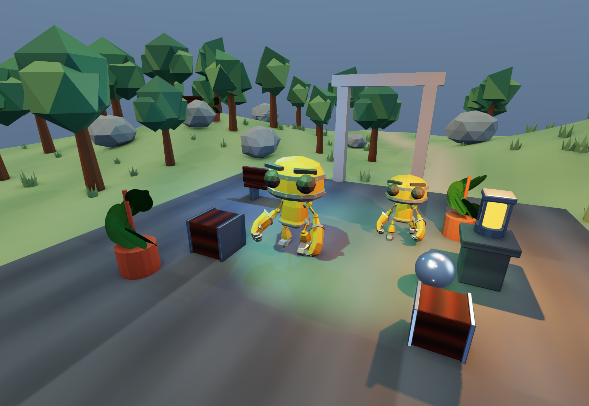
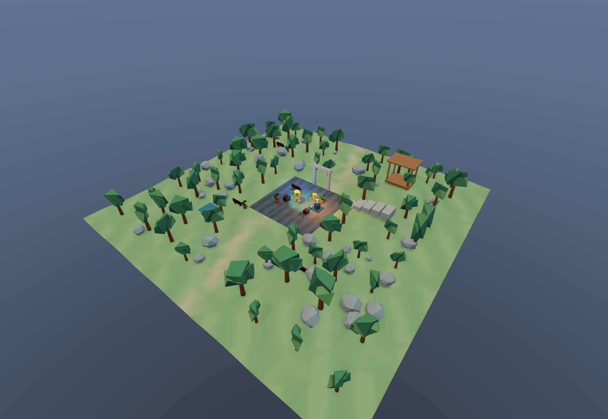
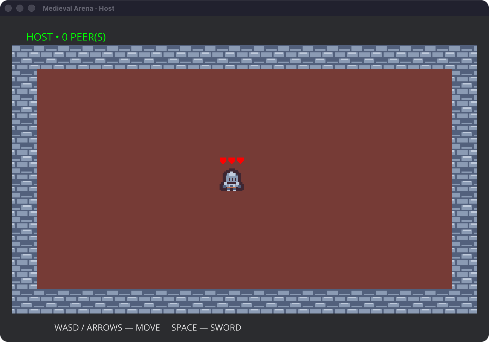
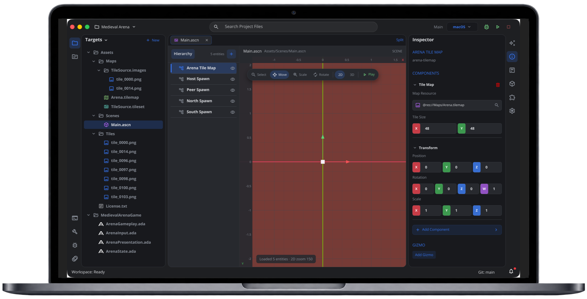
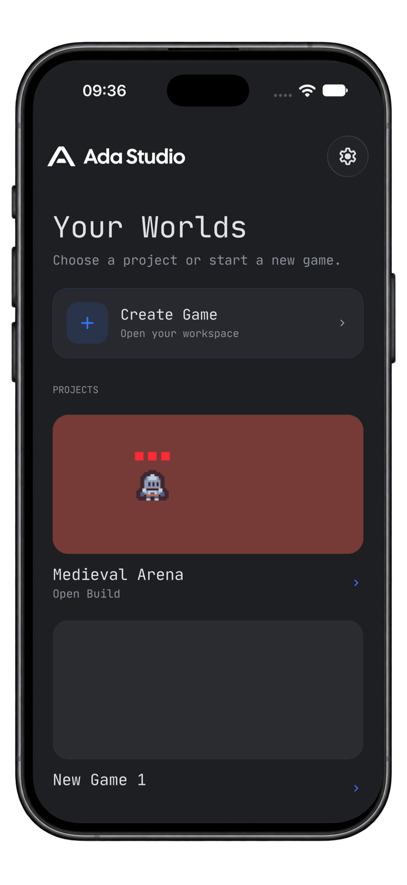

<p align="center">
  <a href="https://adaengine.org">
    
  </a>
</p>

[](https://github.com/AdaEngine/Ada/blob/main/LICENSE)
[](https://swiftpackageindex.com/AdaEngine/Ada)
[](https://swiftpackageindex.com/AdaEngine/Ada)
[](https://deepwiki.com/AdaEngine/Ada)


## What is Ada?

AdaEngine is a game engine written in Swift for building 2D and 3D games and user interfaces. It combines a data-oriented ECS, rendering, physics, animation, and AdaUI. Build games in Swift, or use AdaScript with Ada Studio.

## Games made with AdaEngine

### Skeletal Garden

[Skeletal Garden](Demos/SkeletalGarden/README.md) is a playable 3D demo with animated characters, textured props, lighting, shadows, and a landscape to explore.

<p align="center">
  <a href="Demos/SkeletalGarden/README.md">
    
  </a>
</p>

<details>
  <summary>Explore the whole garden</summary>
  <p align="center">
    
  </p>
</details>

### 2D Demo

[Medieval Arena](https://github.com/AdaEngine/AdaExamples/tree/main/Examples/EngineDemos/Demos/MedievalArena) is a pixel-art arena game with tile maps, movement, sword combat, and multiplayer gameplay written in AdaScript.

<p align="center">
  <a href="https://github.com/AdaEngine/AdaExamples/tree/main/Examples/EngineDemos/Demos/MedievalArena">
    
  </a>
</p>

## Ada Studio

[Ada Studio](Editor/README.md) is the companion editor for AdaEngine. Create projects, edit code and scenes, and run your games from a desktop or mobile workspace.

<table>
  <tr>
    <th>Ada Studio Desktop</th>
    <th>Ada Studio Mobile</th>
  </tr>
  <tr>
    <td align="center" width="75%">
      <a href="Assets/Screenshots/studio-desktop.png">
        
      </a>
    </td>
    <td align="center" width="25%">
      <a href="Assets/Screenshots/studio-mobile.png">
        
      </a>
    </td>
  </tr>
</table>

## Design Goals

* **Capable:** Offer a complete 2D feature set.
* **ECS:** Ada is based on the data-oriented paradigm using a self-written ECS. Ada has been inspired by Apple's RealityKit framework.
* **Simple:** Ada is easy to use, and our main goal is to enable a quick start and deliver quick results.

## 📕 Docs

* **[API Docs](https://docs.adaengine.org/documentation/adaengine/):** Ada's API docs, which are automatically generated from the doc comments in this repo.
* **[Tutorials](https://docs.adaengine.org/tutorials/adaengine/)**: Ada's official tutorials with how to start your first project.
* **Building & Contributing Guides:** [Building](Sources/AdaEngine/AdaEngine.docc/Building.md), [Contributing](Sources/AdaEngine/AdaEngine.docc/Contributing.md)
* **[Architecture Decision Records](Documentation/ArchitectureDecisions/README.md):** Accepted architectural decisions and their implementation status.

## ⭐️ Examples

* **[Ada Awesome Projects](https://github.com/AdaEngine/AdaEngineAwesome)**: Ada's official Awesome Projects page. Feel free to explore.

* **[Ada Examples](https://adaengine.org/demos/)**: Ada's internal examples.

## Getting started

We recommend checking out the **[Create your first project guide](https://docs.adaengine.org/tutorials/adaengine/createproject)** for a brief introduction.

To draw a plain window with standard functionality use:

```swift
import AdaEngine

@main
struct AdaEditorApp: App {
    var body: some AppScene {
        DefaultAppWindow()
            .windowMode(.windowed)
            .windowTitle("Ada")
    }
}
```

## 👥 Community

If you want to discuss this library or have a question about how to use it to solve a particular
problem, there are a number of places you can discuss with fellow

  * For long-form discussions, we recommend the
    [discussions](http://github.com/AdaEngine/Ada/discussions) tab of this
    repo.

## 👨‍💻 Contributing to Ada

You are welcome to contribute to Ada. Currently, it is under development, and we are working towards our roadmap goals. If you find a bug or have some improvements, we would be glad to see your pull request!
See [CONTRIBUTING.md](CONTRIBUTING.md) for details.

## 🛠️ How to build

See the [Building guide](Sources/AdaEngine/AdaEngine.docc/Building.md) for development and integration steps.

Quick start: open `Package.swift` in Xcode 26.3 or build from the command line with `swift build`.
